# Documentation for CMMC deposition workflow

This is a guide to upload your data about microbial metabolites to the collaborative microbial metabolite center knowledgebase (CMMC-kb).

## Important Links:
[GNPS2 website](https://gnps2.org/homepage)

[CMMC workflow](https://gnps2.org/workflowinput?workflowname=cmmc_deposition_workflow)

[CMMC knowledgebase](https://cmmc-kb.gnps2.org/)

[How to get a USI?](get_USI.md)

## What is the CMMC knowledgebase?
Microbiome-derived metabolites are vital for human health and other ecosystems, but there is no central place where the community can store, share, and reuse this knowledge. Existing resources have limited information on microbial metabolites, their sources, genes and functions. To fill this gap, we created CMMC-kb, a knowledge base that integrates microbial information with the GNPS mass spectrometry platform and the community. CMMC-kb enables users to annotate and visualize both known and unknown microbial metabolites, and to explore and interpret their biological roles. CMMC-kb is a community-driven and constantly updated microbiome resource that allows users to link any microbial metabolite, known or unknown, with its source and bioactivity information. Moreover, the web interface and analysis tools provide benefits to both data contributors and other users.

## Requirements
1. A free GNPS2 account is required to contribute data and use the CMMC-kb to analyze data.
   - Please login at the [GNPS2 homepage](https://gnps2.org/homepage)
   
   PS: Currently, the sign-up option is not available, but if you would like to contribute, please send an email with the desired username to hmannochiorusso@health.ucsd.edu

2. CMMC-kb compliant microbial metabolite information.
   - Manual completion of CMMC-kb template file - [link here](https://tinyurl.com/frku9zys)
    
   - Upload CMMC-kb compliant microbial related metabolite information, using the single upload option or batch upload option using the template file - [link here](https://gnps2.org/workflowinput?workflowname=cmmc_deposition_workflow)

## Single upload of microbial metabolites
CMMC-kb provides a platform for users to contribute their own microbial metabolites to the center knowledgebase. There are several requirements for uploading your data, see Requirements.

### Detailed step-by-step instructions:
1. Sign-up or login to your GNPS2 account

2. Navigate to the GNPS2 website and click on the “Launch Workflows” button

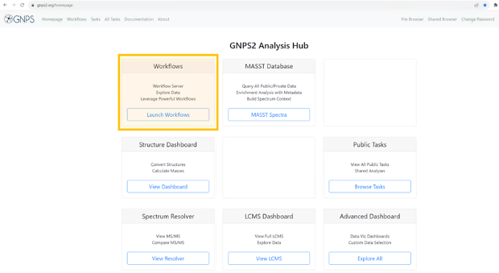

3. This will show the list of available workflows on GNPS2. from this list, select the “_cmmc_deposition_workflow_” and click on _“Launch Workflow_” to start

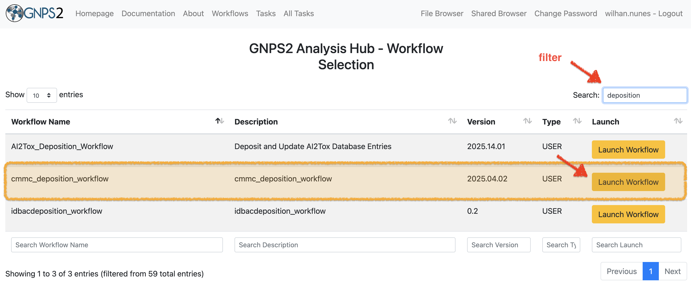

4. At the “_Job Description_” field you are free to fill in what you want (eg. name of metabolite you want to deposit). This description will only be visible for you and it will be the name under which the “_Task_” will be visible in your “_Tasks_” list. This field is not uploaded to CMMC-kb.

5. At the field of the “Workflow” you will select “_Single Upload_’.

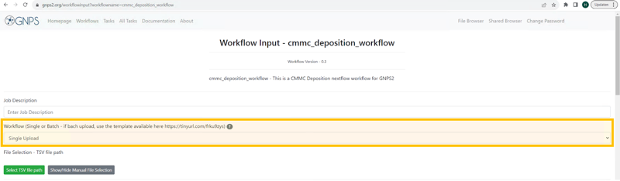
   
6. If you scroll down you will see all the different fields that will have to be filled out with information about the metabolite you want to deposit to the CMMC-kb. The only mandatory field to be filled out is the first one: “_MS/MS identifier_”. Each field is explained in detail below under section **“Step-by-step guideline Input Fields for CMMC-kb workflow**”. Please fill out as many fields as possible for the metabolite you want to deposit.

7. Once you have finished filling out the fields, you can click on the button “_Submit workflow_”. 

8. The task will appear in the menu “Tasks” on the top of your screen:

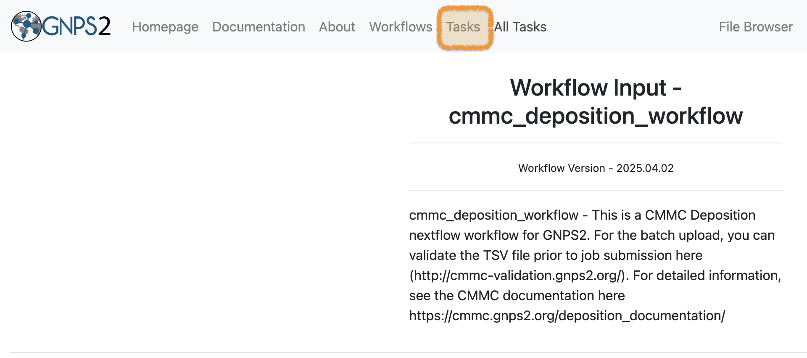

9. Once the upload is complete, the status of the workflow will change from “RUNNING” to “DONE”. If the status is showing “FAILED”, please consult the FAQ section for possible solutions.

## Batch upload of microbial metabolites
Although there's an option to upload individual microbial metabolites, users seeking a more efficient approach can utilize our batch upload feature. This method allows for the simultaneous submission of multiple microbial metabolites to CMMC-kb.

### Detailed step-by-step instructions:
1. Sign-up or login to your GNPS2 account
2. CMMC-kb compliant microbial metabolite information
   - Navigate to the CMMC-kb metabolite information [template](https://tinyurl.com/frku9zys)

The template has the following format:

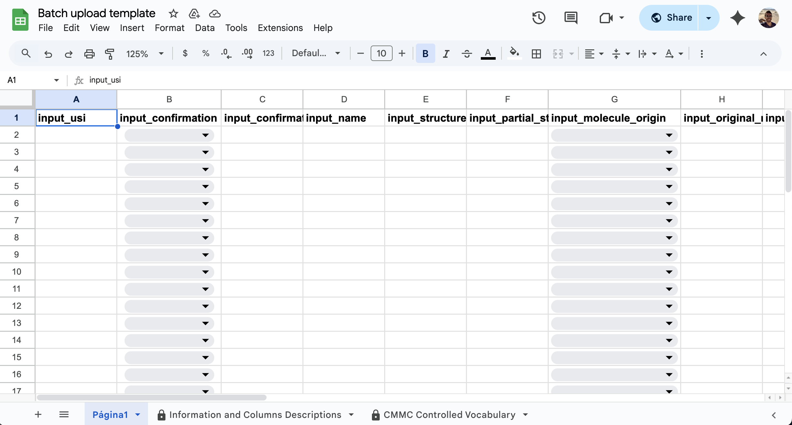

3. Save a copy of the CMMC-kb metabolite information template in your Google Drive by going to "File - Make a copy".

4. Fill in the information in each column using the drop-down menus when applicable. Details for each field are available in the "Information and Columns Descriptions" sheet on the same Google Sheet document, and below in this same documentation.

5. Download the spreadsheet as tab-separated values (.tsv).

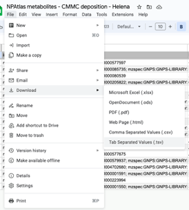

6. Go to the [CMMC deposition workflow](https://gnps2.org/workflowinput?workflowname=cmmc_deposition_workflow)

7. Enter the Job description. This is just for personal tracking of the Job and is not going to be deposited in the CMMC-kb (for example: give the name of the class of metabolites you are uploading).

   -> Select **Batch Upload**

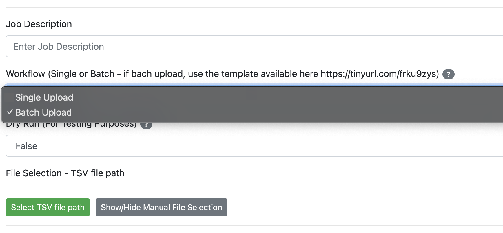

8. Upload your .tsv file to your online environment in GNPS2:
   - Select the menu "File Browser" on the top right

   - Another browser window will open where you will be able to see and organize your files. You can create a new folder (for example: “_CMMC_” and then select "Upload" (red arrow) at the top right. Select your file .tsv file.

9. You can return to the browser where the workflow is open. Select the .tsv file you just uploaded in the “File browser”:
   - Click on "Select TSV file path"

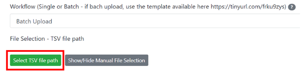

   - Select the .tsv file you want to deposit, and then click on "Add Selected File to TSV file path". 

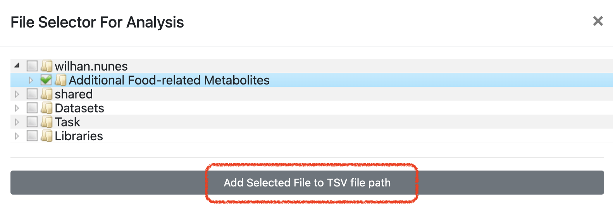

10. Press 'Submit Workflow'

# Step-by-step guideline Input Fields for CMMC-kb workflow (Single and Batch upload)

## Data Selection: 

### MS/MS identifier (input_usi)
_The Universal Spectrum Identifier (USI) is a standardized, unique identifier for mass spectrometry data. It provides a compact, human-readable way to specify a single spectrum derived from a mass spectrometry experiment, regardless of its origin or location._

Please input the Universal Spectrum Identifier (USI) for either an unidentified or a library spectrum. This is the sole required field. For the same molecule, you can input multiple MS/MS spectra corresponding to different adducts (e.g., [M+H]+, [M+Na]+), in-source fragments (e.g., [M-H2O+H]+), or distinct instruments (e.g., orbitrap, qtof). We recommend submitting all available USIs for any given microbial metabolite. Separate each USI using a semicolon.

**_Example:_**
_mzspec:GNPS:GNPS-LIBRARY:accession:CCMSLIB00000426629;mzspec:GNPS:GNPS-LIBRARY:accession:CCMSLIB00000425589_

### Has the metabolite been confirmed or predicted to be microbial?
Please select from the drop-down menu if the metabolite being deposited has been confirmed or predicted to be microbial.

**_Example:_** Predicted

### If predicted, why do you think it is a microbial metabolite?
If "Predicted" was selected in the last field, please describe why you think that this compound is microbially produced. You can describe any analyses that were done or experiments that support that. If this is a confirmed microbial metabolite, this field can be left blank.

**_Example:_** Synthetic compound searched in microbeMASST.

## Metabolite identification: 
### Molecule name (if known) (input_name)
Please input the metabolite's recognized name. If available, use the name corresponding to PubChem (https://pubchem.ncbi.nlm.nih.gov/). For novel molecules, feel free to assign a name. If there are multiple names you want to add, separate each with a semicolon.

**_Example:_** _p-Cresol;4-Cresol_

### Structure (if known, SMILES) (input_structure)
Enter the SMILES for the molecule, if available.

**_Example:_** _CC1=CC=C(C=C1)O_

### Partial structure (input_partial_structure)
If the molecule hasn't been fully characterized yet, provide details on the known partial structures. This can include partial SMILES, descriptions of functional groups, or the molecule's class.

**_Example:_** _Based on the isotopic pattern, the molecule contains at least one Chlorine atom._

### Molecule origin (input_molecule_origin)
From the drop-down menu, choose the most fitting origin for the molecule.
The following categories are present:
  - Microbial metabolism of drugs
  - Microbial metabolism of food molecules
  - Microbial metabolism of other human-made molecules
  - Microbial metabolism of host-derived molecules
  - Microbial metabolism of microbial-derived molecules
  - Host metabolism of microbial metabolites
  - De novo biosynthesis by microbes (e.g., natural products and other specialized metabolites)
  - Unknown/Undefined

**_Example:_** 

_**Microbial metabolism of drugs:** Digoxin gets metabolized into dihydrodigoxin and dihydrodigoxigenin by gut Eggerthella lenta which are inactive metabolites. For dihydrodigoxin and dihydrodigoxigenin, the category would be: microbial metabolism of drugs._

_**Microbial metabolism of food molecules:** Glucosinolates, found in cruciferous vegetables like broccoli and Brussels sprouts, can be converted by the microbiota into isothiocyanates that have potential anti-cancer properties. For the isothiocyanate, the category would be microbial metabolism of food molecules. Another example for this category would be the short-chain fatty acids, as they are produced by bacteria from dietary fiber._

_**Microbial metabolism of other human-made molecules:** Bisphenol A (BPA), a component of many plastics, BPA can be degraded by several bacterial species, reducing its environmental persistence and potential endocrine-disrupting effects. The degradation product of BPA would fall into this category._

_**Microbial metabolism of host-derived molecules:** Bile acids turned into secondary bile acids. The secondary bile acids would fall into this category._

_**De novo biosynthesis by microbes (e.g., natural products and other specialized metabolites):** Antibiotics (eg. penicillin, streptomycin), siderophores, lipopeptides._

_**Unknown/Undefined:** When your microbial metabolite does not fit any of the catergories mentioned above, or if it is still unknown._

### Name of the original molecule that is being modified by the microbe (input_original_molecule_name)
If the metabolite results from microbial metabolism, provide the name of the precursor molecule.

_**Example:** For p-cresol this would be: p-Hydroxyphenylacetic acid;4-Hydroxyphenylacetic acid_

### Structure of the original molecule that is being modified by the microbe (input_original_molecule_structure)
If the metabolite originates from microbial metabolism, input the structure of the precursor molecule, using either SMILES or INChI format.

_**Example:** p-Hydroxyphenylacetic acid is also a microbial metabolite (besides being derived from human metabolism and diet): C1=CC(=CC=C1CC(=O)O)OC1=CC(=CC=C1CC(=O)O)O_

## Taxonomy/Phylogeny selection:
### Microbe/Virus ID (NCBI) (input_microbe_ncbi)
Input the name of the microbe responsible for producing the metabolite. Please provide the NCBI taxonomy ID (https://www.ncbi.nlm.nih.gov/taxonomy). If the particular microbe lacks an NCBITaxonomyID at the strain or species level, submit the most detailed level available, potentially the genus. For multiple NCBITaxonomyIDs, separate each with a semicolon.

_**Example:** 53443; 1496; 133926; 1537; 261299_

### Microbe name (input_microbe_name)
Input the microbe's name at the most detailed level available. If listing multiple microbes, separate each with a semicolon.

_**Example:** Blautia hydrogenotrophica; Clostridioides difficile; Olsenella uli; Romboutsia lituseburensis; Intestinibacter bartlettii_

### Microbe/Virus DNA/RNA (sequence information for taxonomic assignment e.g. full genome, 16S, or 18S sequence) (input_microbe_DNARNA)
If there is no NCBI Taxonomy ID but you have the microbe's sequence, please input the sequencing data for the organism or virus in FASTA format.

### Microbial community (input_microbial_community)
_Microbial community: Short-chain Fatty Acids (SCFAs) from Polysaccharide Fermentation: While individual microbes can produce SCFAs like acetate, propionate, and butyrate from the fermentation of dietary fibers, the maximum yield and variety of SCFAs in the gut often result from a succession of microbial activities. 
For instance:_
_1. Primary fermenters break down complex polysaccharides into simpler oligosaccharides and monosaccharides._
_2. Other microbes can then ferment these simpler sugars to produce intermediate metabolites like lactate or succinate._
_3. A third group of microbes can subsequently convert these intermediates into SCFAs._

If the metabolite is produced by a microbial community, enter the link to the raw sequencing data.

### Microbial community description (input_microbial_community_description)
If the metabolite is produced by a microbial community, enter the description of the microbial community.
Please be as complete as possible in naming the individual bacteria at strain/species level involved in the community. 

## Biosynthesis:
### Biosynthesis of the molecule (MIBiG Accession) (input_biosynthesis_mibig)
_MIBiG, which stands for Minimum Information about a Biosynthetic Gene cluster, is a standardized format for the annotation and reporting of biosynthetic gene clusters (BGCs). BGCs are groups of genes that work together to produce secondary metabolites in microbes. These secondary metabolites can include antibiotics, antifungals, and other bioactive compounds._

If the knowledge about the biosynthesis of the metabolite has been curated in MIBiG, enter the accession number (https://mibig.secondarymetabolites.org/repository). In the screenshot below, the accession number for “penicillin” is marked in yellow. 

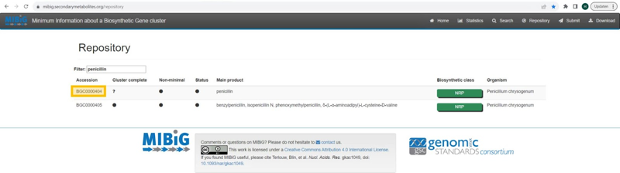

### Biosynthesis of the molecule (set of Gene names or sequence and description) (input_biosynthesis_genes)
If the MIBiG repository doesn't contain biosynthesis details for the metabolite, kindly share any relevant information you possess. If multiple genes are involved or can produce the metabolite, these can be added separated by semicolon. This could be gene names or sequence data. For sequence submissions, please use the FASTA format.

_**Example:** hpdB (CD630_01530);hpdC (CD630_01540);hpdA (CD630_01550)._

### Biosynthesis description (input_biosynthesis_description)
If the MIBiG repository doesn't contain biosynthesis details for the metabolite, kindly share any relevant information you possess. Please be as complete as possible. Everything that is known about the biosynthesis is relevant to put here when it is not present in MIBiG.

### Metabolite source (input_source)
From the drop-down menu, select the source(s) of the metabolite. The following categories are present: 
   - Microbial
   - Microbial and Host
   - Microbial and Diet
   - Microbial, Host, and Diet
   - Unknown

_**Example:**_
_**Microbial:** Select this category when you are certain that the metabolite is only produced by microorganisms. Please note, some microbial metabolites can also be obtained by diet (e.g. fermented foods). Examples would be: Indole-3-propionic acid, N-acyl homoserine lactones, enterobactin._
_**Microbial AND Host:** Select this category when you are certain that the metabolite can be produced by bacteria AND host. An example would be: 2-hydroxybutyric acid._
_**Microbial AND Diet:** Select this category when you are certain that the metabolite can be produced by bacteria AND obtained through diet. Examples would be: p-Cresol, indole-3-acetic acid, indole-3-lactic acid._
_**Microbial, Host, AND Diet:** Select this category when you are certain that the metabolite can be produced by bacteria AND Host AND obtained through diet. Examples would be: acetate, valeric acid, 4-hydroxyphenyl pyruvate._
_**Unknown:** If you do not know the origin of your microbial metabolite, please use this category._

## Activity:
### Activity of the molecule (input_activity)
Describe the activity or function of the microbial metabolite if known. More than one activity can be added separated by semicolon. It can be simple descriptions or more complete.

_**Example:** Acetate acts via at least two major signaling pathways. Based on their mode of action, it is proposed that they can be conceptualized as the acetyl-CoA signaling branch and the G-protein signaling branch. The acetyl-CoA branch involves regulation of protein function and gene transcription via acetylation/deacetylation cycles, as well as through AMPK kinase cascades. This signaling system is operative in all cell types, but the responses are cell type-specific. In contrast, the G-protein branch signals through cyclic AMP (cAMP) and phospholipase C (PLC) and is restricted to certain cell types. The acetyl-CoA branch is linked to the integrated stress response (ISR) associated with oxygen and nutrient deprivation, whereas the G-protein branch involves metabolic regulation based on fatty acid levels (33304273); Free fatty acid receptor 2 (GPR43) is activated by acetate  (12496283)_

### Amount and units of the observed activities (input_concentration_activity)
Enter the amount and units of the observed activities, e.g., concentration, normalized units, or ratios. If more than one activity was described in the previous field, enter the amounts and units of the observed activities separated by semicolon in the same order as the previous field.

_**Example:** Sirtuins play a pivotal role in regulating acetate metabolism through their interactions with two key enzymes known as acyl-CoA short-chain synthetases (ACSS). The ACSS enzymes are the only known mammalian enzymes that can convert free acetate into acetyl-CoA. ACSS1 and ACSS2 predominantly utilize acetate as substrate. Km ACSS1: 0.6 mM; Km ACSS2: 0.11 mM; Km ACSS3: 5.4 mM (11150295;28003429;33281616); Free fatty acid receptor 2 (GPR43) exhibits an EC50 of 52 ± 10 μM for acetate (12496283); Free fatty acid receptor 3 (GPR41) exhibits an EC50 of 1020 ± 200 μM for acetate (12496283)_

### Phenotype associated with the molecule (input_phenotype_associated)
Enter the phenotype known to be associated with the microbial metabolite, if known. More than one phenotype can be added separated by semicolon. Links for other databases can also be provided (e.g., http://ctdbase.org/detail.go?type=chem&acc=C005197&view=phenotype).

_**Example:** From a mouse model of C. difficile infection, it has been shown that excessive p-cresol production affects the gut microbiota biodiversity (30208103); p-Cresol has been recently identified in volunteers as a fecal biomarker of C. difficile infection (30986230)._

### Phenotype regulation (phenotype_regulation)
Depending on the aforementioned phenotype, please specify the phenotype direction: up-regulated or down-regulated. If more than one phenotype was described in the previous field, enter the direction for each phenotype separated by semicolon in the same order as the previous field.

_**Example:** upregulated; downregulated_

### Amount and units of the observed phenotype (input_concentration_phenotype)
Enter the amounts and units of the observed phenotype, e.g., concentration, normalized units, or ratios. If more than one phenotype was described in the previous fields, enter the amounts and units of the observed phenotype separated by semicolon in the same order as the previous fields.

_**Example:** For the p-cresol example, if it is known it would be nice to give the concentration of p-cresol that is associated with the affected microbiota diversity._

## References:
### References (semicolon separated PMID) (input_references)
Provide all references that support the previous inputs as PubMed IDs (https://pubmed.ncbi.nlm.nih.gov/). More than one entry can be specified separated by semicolon.

_**Example:** 29982420; 34744609; 31639103; 826152; 34468872; 9115181; 10570076_

### References (enter URL link if no PMID) (input_references_link)
If no PMID is available, provide references that support the previous inputs as URL (preprint, webpage, etc). More than one entry can be specified separated by semicolon.

_**Example:** https://www.omim.org/entry/606054; https://doi.org/10.1111/j.1574-6941.1992.tb00002.x_

## Grant information:
### Grant agency (grant_agency)
Enter the grant agency that supports you. While optional, this will allow granting agencies to both track what grants are benefiting from this resource but also allows the depositor to provide this information in progress reports. Multiple agencies can be provided separated by semicolon.

_**Example:** NIH_

### Grant number (grant_number)
Enter the grant number. While optional, this will allow granting agencies to both track what grants are benefiting from this resource but also allows the depositor to provide this information in progress reports. Multiple grant numbers can be provided separated by semicolon.

_**Example:** 1U24DK133658-01_

## Comments:
### Comments (input_comment)
Provide any additional information that is relevant for the metabolite (e.g., link for data deposited in NMR repositories (e.g., https://np-mrd.org/), color, physicochemical properties, synonyms, etc) and/or the description of the source from which this metabolite was observed.

_**Example:** NMR available at: https://np-mrd.org/natural_products/NP0001009_

# Frequently asked questions
## What does each column mean?
The Step-by-step guideline above gives detailed information on what each column means and the second sheet in the batch template called "Information and Columns Descriptions", also contains detailed information on each column.

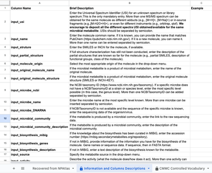

## Page Contributions
Martijn van Faassen, Helena Mannochio-Russo, Marilyn de Graeve
