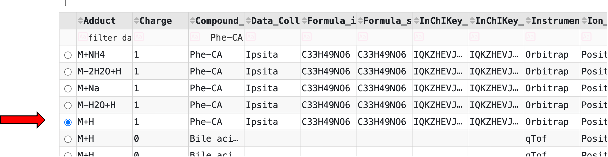
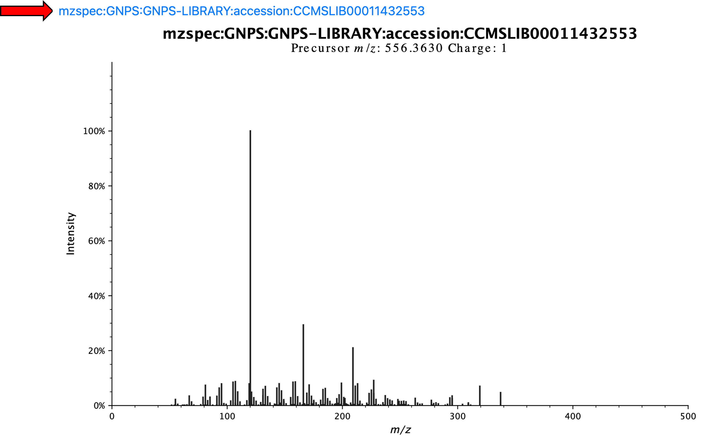
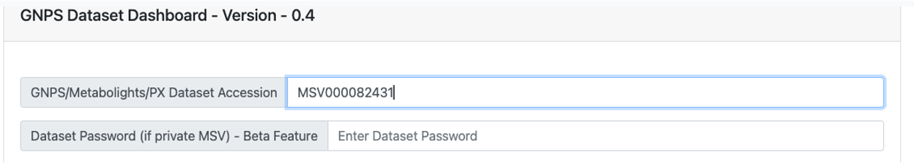
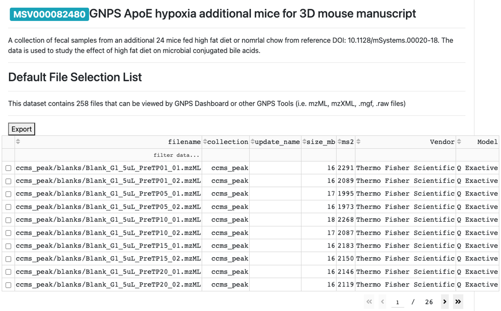
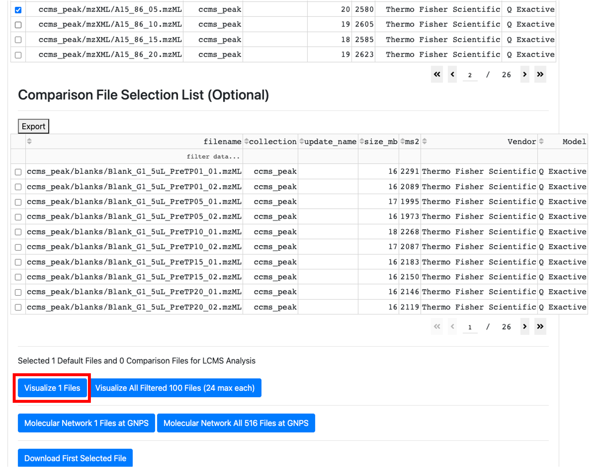
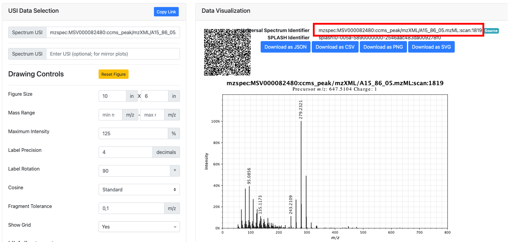

# Documentation for CMMC deposition workflow

This is a guide on how you can get a USI to further deposit it in the collaborative microbial metabolite center knowledgebase (CMMC-kb). 

# Important links:

[GNPS2 website](https://gnps2.org/homepage)

[Metabolomics Spectrum Resolver](https://metabolomics-usi.gnps2.org/)

[Metabolomics Spectrum Resolver preprint](https://www.biorxiv.org/content/10.1101/2020.05.09.086066v2)

[GNPS Dashboard](https://dashboard.gnps2.org/)

## What is a USI?
USI stands for Universal Spectrum Identifier, which provides a standardized mechanism for encoding a virtual path to spectra contained in public metabolomics repositories. Currently, it supports data formats from GNPS, GNPS2, MassBank, MS2LDA, MassIVE, MetaboLights, and Metabolomics Workbench and is integrated into several of these resources. 

## How can I get a USI for my spectrum?
First, we must get the mass spectrometry data into a public repository. While GNPS/MASSIVE is the preferred repository, USI’s can be linked from other repositories including Metabolights and Metabolomics Workbench. Please visit those websites for upload instructions as this document will focus on GNPS/MassIVE. 

If you don’t have MS/MS data on the microbial molecules, please contact the CMMC team as we will help collect it for you, or come up with an experimental plan so you can collect such data. There are several methods to upload mass spectrometry data to GNPS/MassIVE, and they can be separated into **single MS/MS** or via entire untargeted mass spectrometry **files** or **projects**. The MS/MS and/or data files must be public before they can be used for the CMMC microbial metabolite KB curation.

### 1) Conversion to .mzML  
The first step is to make sure that the data is in a compatible format. The CMMC-KB will use .mzML as input files. This is an open mass spectrometry format, and depending on the vendor, the conversion can be achieved following different steps. The vendor could have a software that supports this kind of conversion, or it can be achieved following the instructions found [here](https://ccms-ucsd.github.io/GNPSDocumentation/fileconversion/). In addition, if it is a small data set (<50 files), it is possible to use [drag-and-drop conversion](https://gnps-quickstart.ucsd.edu/conversion) of the data.

### 2) Uploading the data
**- Adding data to a Spectral Library or creating a new one**

For adding individual MS/MS spectra into the GNPS libraries, we have step-by-step instructions [here](https://ccms-ucsd.github.io/GNPSDocumentation/spectrumcuration/). There is also a batch process for the creation of a new MS/MS library that can be achieved by [batch upload](https://ccms-ucsd.github.io/GNPSDocumentation/batchupload/). In addition, if GNPS analysis tools (such as molecular networking) are used, one can also use “reannotate” to add the MS/MS spectrum to the library.

**- Uploading the entire file or dataset from which MS/MS will be selected for curation of the CMMC-kb**

For small data sets, the [quick start](https://gnps-quickstart.ucsd.edu/massivesubmission) approach with a drag-and-drop interface can be used.

When it is a larger LC-MS/MS dataset, then please follow the instructions [here](https://ccms-ucsd.github.io/GNPSDocumentation/datasets/).

We highly encourage that a metadata table associated with files is deposited as well. The [ReDU template](https://mwang87.github.io/ReDU-MS2-Documentation/HowtoContribute/) is recommended as this can leveraged in MASST, ReDU interface, and domain-specific MASST tools such as foodMASST and microbeMASST.

### 2) Getting the USI
**- From spectra deposited in the libraries**

All MS/MS spectra that are curated in a GNPS spectral library can be found [here](https://library.gnps2.org/). To get the USI, find the compound of interest by searching the columns or SMILES. For example, the USI for the microbially conjugated Phe-CA can be found by typing "Phe-CA" and clicking in the circle relative to the row you want to select.

Clicking on the circle results in the display of the spectrum and the USI, which are visible by scrolling up.

Therefore, this is the USI for this spectrum highlighter above:
**mzspec:GNPS:GNPS-LIBRARY:accession:CCMSLIB00011432553**

**- From a public LC-MS/MS dataset**

- Go to the GNPS Dashboard and wait a few seconds for the page to load.
- Provide the data accession number (MassIVE ID) of the dataset.

- When the dataset is loaded in the GNPS Dashboard, then the name of the dataset and associated files will show up.

- Select the file from which you want to use the MS/MS to upload to the CMMC-kb.

  PS: if the file is not already cashed, it may take a few minutes to show up on the webpage.

- After selecting the .mzML file of interest, scroll up and click on "_visualize 1 file_".

- Filter for the ion of interest. 

Detailed descriptions of how to navigate the GNPS Dashboard can be found [here](https://ccms-ucsd.github.io/GNPSDocumentation/lcms-dashboard/). Briefly, it is possible to filter by the ion of interest using the XIC options or by scrolling to the retention time and m/z visualization window and then clicking on the blue X to get the MS/MS spectrum.

- In the MS/MS visualization, click on "_View Metabolomics USI_".

- Get the USI from the new window.

## Page Contributions
Helena Mannochio-Russo, Pieter Dorrestein

