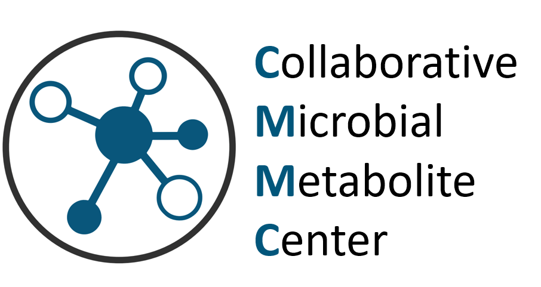

# Collaborative Microbial Metabolite Center

Welcome to the Collaborative Microbial Metabolite (CMMC) Center at the UC San Diego and UC Riverside. The goal of the CMMC is to build a microbial metabolite knowledgebase with and for the scientific community according to the RFA Identification and Characterization of Bioactive Microbial Metabolites. This center is supported by the National Institutes of Health (NIH) Advancing Research on Microbe-Diet-Host Interactions Knowledgebase Management Center (U24) grant mechanism - [RFA Link](https://grants.nih.gov/grants/guide/rfa-files/rfa-dk-21-014.html). 

## Key Objectives
We aim to capture the knowledge about microbial metabolites, even detectable but uncharacterized microbial metabolites to build a microbial metabolite knowledgebase. The goal of the knowledgebase is to ensure it can be reused to make it easier to mechanistically understand the functional role of the microbiome. This will be accomplished through digitizing the relationships between diet, host and microbial metabolism and the activities of the metabolites. 

## Tools created by the CMMC with and for the community
Here is a list of tools that were developed specifically for the CMMC that is in conjunction with the computational tools available at UCSD and UCR. 

### Microbial metabolite knowledge upload portal
To build the microbial knowledgebase, we have generated an upload portal. This will generate the foundational knowledgebase to enable future tool building. As RO1 grantees add to the knowledgebase, it will be immediately usable in GNPS-based molecular networking ([Link](https://ccms-ucsd.github.io/GNPSDocumentation/)) so that microbial metabolite knowledge can be immediately identified from complex samples. 

The upload portal can be accessed [here](https://gnps2.org/workflowinput?workflowname=cmmc_deposition_workflow), where it is possible to do a single or batch upload.

The knowledgebase is being constantly updated with new inputs from the community and can be accessed [here](https://cmmc-kb.gnps2.org/).

<!-- !!!!MING TO DO create the firs generation link to simple interface for building the knowledgebase!!!!. -->

### MicrobeMASST

[MicrobeMASST](https://masst.gnps2.org/microbemasst/) allows MS/MS searches against >60,000 LC-MS/MS files from cultured bacteria and fungi. Such searches allow the user to observe whether the same MS/MS (or analog) belongs to a microbial metabolite of interest.

For more information about microbeMASST, check out the [preprint](https://doi.org/10.1101/2023.07.20.549584) currently available!

### Network enrichment workflow
The [Molecular Networking enrichment workflow](https://gnps2.org/workflowinput?workflowname=cmmc_gnps_network_enrichment_workflow) was also developed to enable users to reuse the knowledgebase to interpret their own datasets and how microbial metabolites could be playing a role in a specific study.

### R01s Supported by CMMC

This infrastructure is being built with R01's that responded to 
Identification and Characterization of Bioactive Microbial Metabolites for Advancing Research on Microbe-Diet-Host Interactions (R01) https://grants.nih.gov/grants/guide/pa-files/par-21-253.html Here is a link to all the current R01 grantees that received awards under this mechanism - [All R01 Grants Link](https://reporter.nih.gov/search/eJ5UvHBXWU6-ZQa83cfFnw/projects). In addition, the CMMC will be curated with the large scientific community.

## Leadership
Pieter C. Dorrestein - UC San Diego - [Lab Link](https://dorresteinlab.ucsd.edu/)

Mingxun Wang - UC Riverside - [Lab Link](https://www.cs.ucr.edu/~mingxunw/)

Nuno Bandeira - UC San Diego 

Robin Knight - UC San Diego

## Database Statistics Summary

### CMMC-KB Growth

### CMMC-KB - Top contributors*

| User             | Depositions | %     |
|------------------|-------------|-------|
| wilhan.nunes     | 25489       | 81.71 |
| fernandaoliveira | 2241        | 7.18  |
| amcaraballor     | 789         | 2.53  |
| helenamrusso     | 442         | 1.42  |
| luciacancelada   | 339         | 1.09  |
| hfaassen         | 274         | 0.88  |
| zhaohaoq         | 204         | 0.65  |
| simonezuffa      | 185         | 0.59  |
| smagyari         | 178         | 0.57  |
| ikoester         | 151         | 0.48  |
| yasel            | 148         | 0.47  |
| fvasquezcastro   | 111         | 0.36  |
| GiovanniAndrea   | 102         | 0.33  |
| spthomas         | 102         | 0.33  |
| mohantyipsita92  | 88          | 0.28  |
| ACumsille        | 67          | 0.21  |
| iliakopsofia     | 63          | 0.20  |
| moyses           | 48          | 0.15  |
| liviasoman       | 40          | 0.13  |
| pwpgomes         | 39          | 0.13  |
| rrtorres         | 27          | 0.09  |
| monicamonge      | 20          | 0.06  |
| oloap2           | 10          | 0.03  |
| sabina.llarosa   | 9           | 0.03  |
| tekela           | 9           | 0.03  |
| sh1646           | 8           | 0.03  |
| neavalon         | 6           | 0.02  |
| berenike.wagner  | 4           | 0.01  |

<small style="font-size: 0.8em;">*Top contributors in terms of total USIs deposited. This may not represent unique compounds.
 As of: 10/31/2024</small>
