# Documentation for Network Enrichment workflow
This is a guide for Network Enrichment Workflow in the collaborative microbial metabolite center knowledgebase (CMMC-kb). 

## Important Links:
[GNPS2 website](https://gnps2.org/homepage)

[Network Enrichment workflow](https://gnps2.org/workflowinput?workflowname=cmmc_gnps_network_enrichment_workflow)

[CMMC knowledgebase](https://cmmc-kb.gnps2.org/)

## Molecular Network Enrichment Workflow ([cmmc_gnps_network_enrichment_workflow](https://gnps2.org/workflowinput?workflowname=cmmc_gnps_network_enrichment_workflow))

### Logging in to GNPS2 and Launching the Workflow
**Step 1.** Log in to your GNPS2 account.

**Step 2.** Navigate to the GNPS2 website and click on the "Launch Workflows" button

**Step 3.** This will show the list of available workflows on GNPS2. From this list, select the "cmmc_gnps_network_enrichment_workflow" and click on "Launch Workflow" to start.
<a href="https://gnps2.org/workflowinput?workflowname=cmmc_gnps_network_enrichment_workflow" target="_blank">Click here if you want to jump to the workflow directly</a>

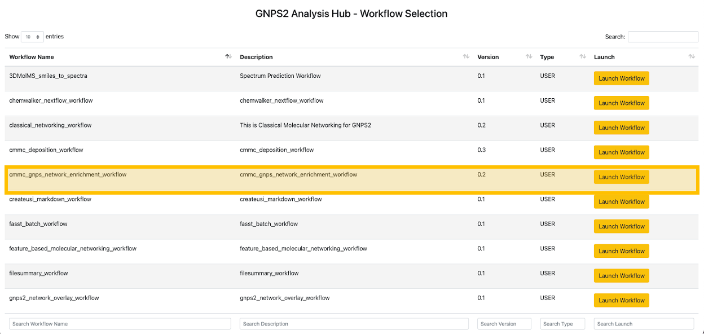

### Filling out the Workflow Parameters

#### Basic Job Setup
**Step 4.** In the "Job Description" field, you are free to fill in any name (e.g., the name of the network you want to enrich).
**Step 5.** For the "Type" field, select GNPS1 or GNPS2 depending on the type of data you are using.

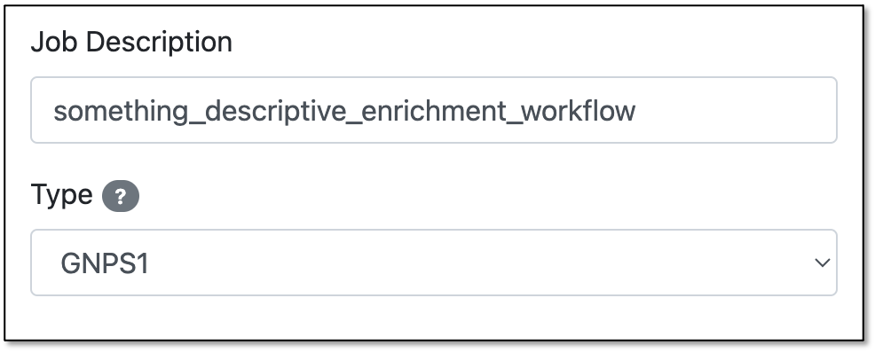

??? question "GNPS1 vs GNPS2"
    - **GNPS1**: This is the original GNPS platform, which is still in use for many existing jobs. See the requirements under ["Import From GNPS1"](#import-from-gnps1) below.
    - **GNPS2**: This is the newer version of GNPS, which has additional features and improvements. If your data is from a GNPS2 job, select this option. In this case, you will need to provide the files under the section ["Import From GNPS2"](#import-from-gnps2) below.

#### Import From GNPS1
**Step 6.** Under the "Import From GNPS1" section, you will have to enter the "GNPS Networking Task."

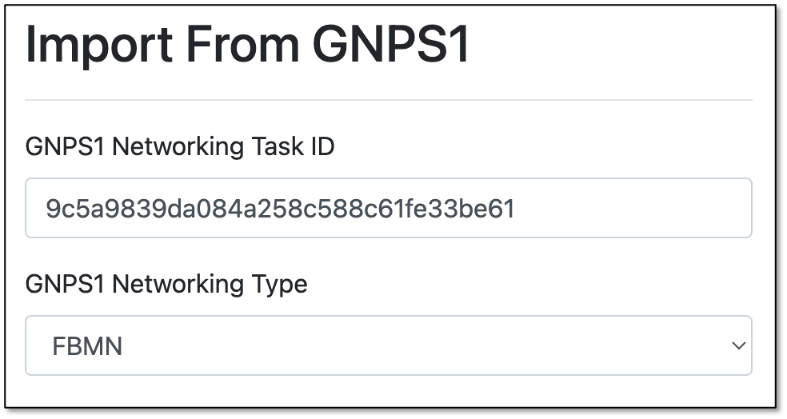

??? note "Getting the GNPS1 Networking Task ID"
    The "GNPS Networking Task" refers to the task ID from a molecular networking job performed on GNPS1 (https://gnps.ucsd.edu/). 
    
    For the GNPS1 URL, the task ID is the string after "task=": 
    https://gnps.ucsd.edu/ProteoSAFe/status.jsp?task=**9c5a9839da084a258c588c61fe33be61**

**Step 7.** Choose the type of network to be enriched:
    - Classical: Select Classical if the original molecular networking job was run on the classical workflow 
(i.e., the data was not pre-processed prior to molecular networking).
    - FBMN: Select FBMN (Feature-Based Molecular Networking) if the data was pre-processed prior to molecular networking 
in software like MZmine, OpenMS, MS-DIAL, etc.

#### Import From GNPS2

??? tip inline end "Downstream Analysis"
    Another convenient way of performing an enrichment analysis is to access a previous Feature-Based Molecular Networking (FBMN) or Classical Networking job performed using the GNPS2 platform.
     Under the "Downstream Analysis" section, click **"Downstream Analysis - CMMC Enrichment Analysis"**.
     This will automatically open the Enrichment Workflow page with all the file selections already filled out. You can then proceed to [fill out the parameters](#library-search) and submit the job.

For this field, you can directly select the files from a GNPS2 job to perform the network enrichment.

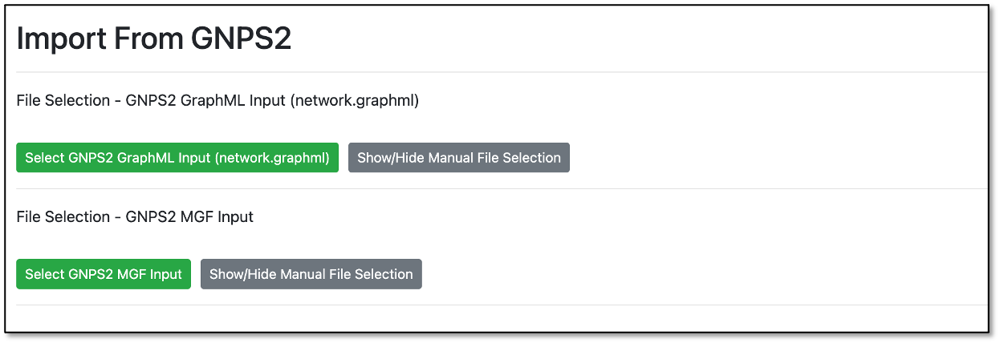

By clicking either one of the green buttons, a popup window will open with a file selection tree.

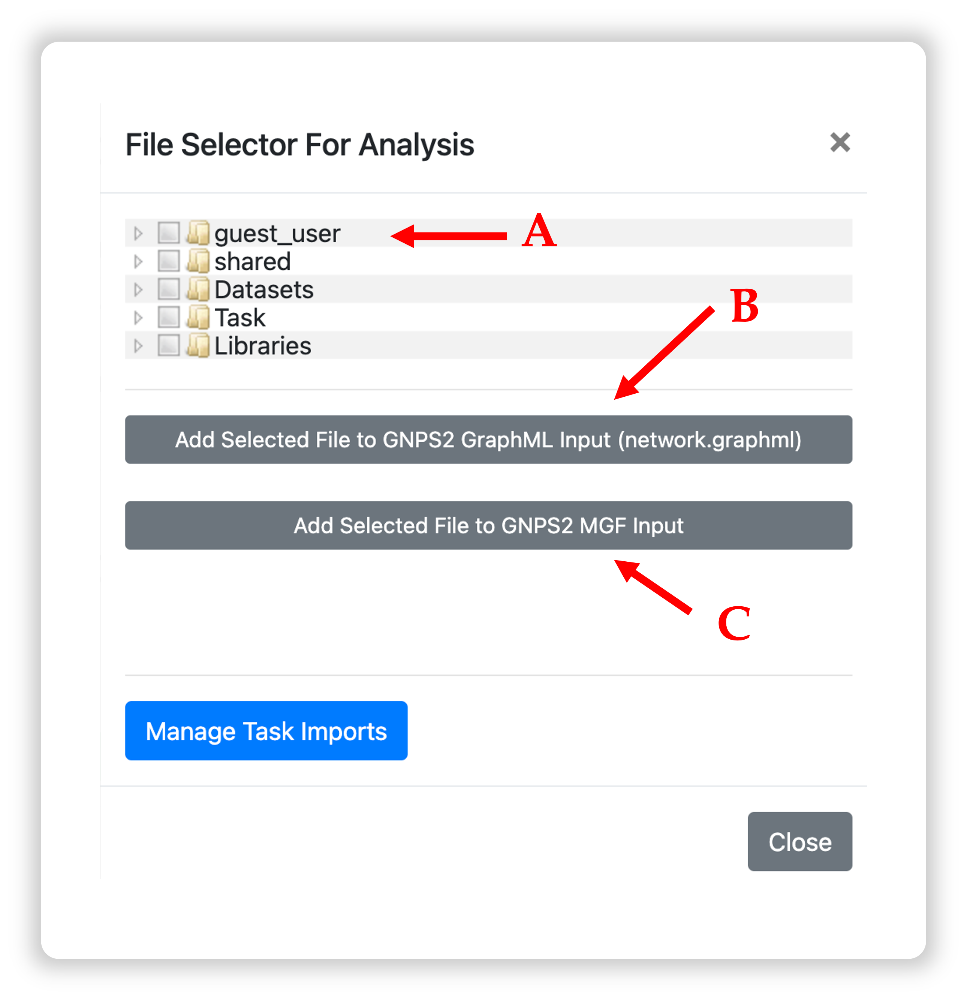

**A:** Navigate the folder tree to find the GraphML file you want to use for the network enrichment, and mark the checkbox next to the file.  
**B:** Click "Add Selected File to GNPS2 GraphML input" to add the file to the input list. 
**C:** Repeat Step A for the MGF file, then click "Add Selected File to GNPS2 MGF input."

!!! note "The order of file selection does not matter as long as you use the correct buttons while adding them."

#### Library Search
**Step 8.** In the "Library Search" section, specify the parameters for the enrichment analysis. See the table below for a detailed description of each parameter.

| Parameter                             | Description                                                                                                                                                                                                                                                                                                                                                           | Recommended/Default Value                                                                                     |
|---------------------------------------|-----------------------------------------------------------------------------------------------------------------------------------------------------------------------------------------------------------------------------------------------------------------------------------------------------------------------------------------------------------------------|---------------------------------------------------------------------------------------------------------------|
| Precursor Ion Tolerance               | Parameter used for spectral library search, expressed in Daltons. This value specifies how much the precursor ions can be shifted from their expected m/z values. Note that the value of this parameter should be consistent with the capabilities of the mass spectrometer and the specific instrument method used to generate the MS/MS data.                       | ± 0.02 Da for high-resolution instruments (q-TOF, q-Orbitrap) and ± 2.0 Da for low-resolution instruments (ion traps, QqQ). |
| Fragment Ion Tolerance                | Parameter used for MS/MS spectral library searches. This value specifies how much fragment ions can be shifted from their expected m/z values.                                                                                                                                                                                                                        | ± 0.02 Da for high-resolution instruments (q-TOF, q-Orbitrap) and ± 0.5 Da for low-resolution instruments (ion traps, QqQ). |
| Library Minimum Cosine                | Minimum cosine score between the spectra being searched and the ones deposited in the CMMC libraries. Lower cosine values can increase the number of false hits, as it becomes less strict.                                                                                                                                                                           | _Default: 0.7_                                                                                               |
| Library Minimum Match Peaks           | Minimum number of common fragment ions that are shared between the queried spectrum and the ones deposited in the library. This parameter should be adjusted depending on the molecule of interest, the experimental conditions for mass spectra acquisition, and the collision-induced fragmentation settings. High MW compounds tend to produce more fragment ions. | _Default: 6_                                                                                                 |
| Number of Results to Report per Query | The maximum number of library hits that a queried spectrum can have, considering the settings of the other parameters.                                                                                                                                                                                                                                                | _Default: 1_                                                                                                 |
| Analog Search                         | Enables analog search. Matches query spectra against library MS/MS spectra with a modification-tolerant search (different precursor ion mass value). The results have to be carefully curated, since this will introduce more false positives.                                                                                                                        | _Default: False_                                                                                             |
| Analog Max Shift Mass                 | Maximum mass shift between the library and putative analogs found.                                                                                                                                                                                                                                                                                                    |                                                                                                               |

#### Advanced Filtering Parameters
| Parameter               | Description                                                                                                                                                                                   | Default |
|-------------------------|-----------------------------------------------------------------------------------------------------------------------------------------------------------------------------------------------|---------|
| Minimum Peak Intensity  | All fragment ions in the MS/MS spectra below this raw intensity value will be deleted. By default, the filtering is disabled.                                                                 | 0       |
| Precursor Window Filter | All peaks in a +/- 17 Da around precursor ion mass are deleted. Enabled by default. This removes the residual precursor ion, which is frequently observed in MS/MS spectra acquired on qTOFs. | Filter  | |
| Window Filter           | Filter out peaks that are not in the top 6 most intense peaks in a +/- 50Da window                                                                                                            | Filter  |

**Step 9.** Once you have finished filling out the fields, click on the "**Submit Workflow**" button.

#### Enrichment Results

**Step 10.** After the status of the job is marked as "Done," an overview of the results can be achieved by clicking on "CMMC Search Results."

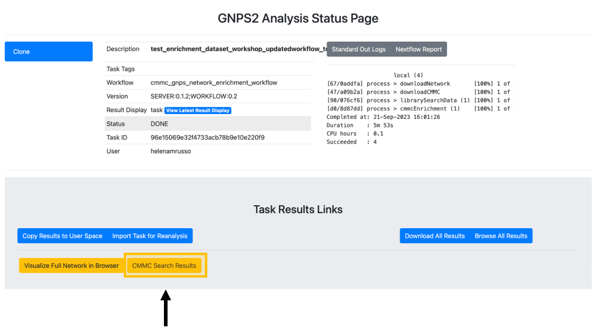

**Step 11.** After clicking on "CMMC Search Results", a new window opens that looks like this one, and rapidly you can see which metabolites deposited in CMMC matched with the experimental spectra. In addition, you can see which microbes produce these compounds (in the example below, deoxycholic acid conjugated to alanine).

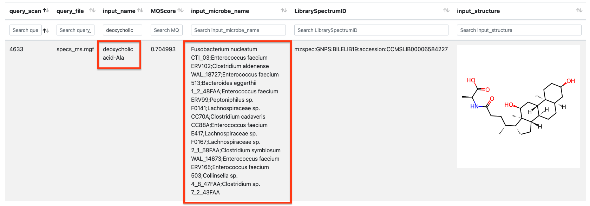

**Step 12.** To do molecular networking, scroll down under the "Task Results Links" and click on "Browse All Results" if you want to specifically download the results for the molecular networking visualization. You can also click on "Download All Results" if you want to have all files in your local computer.

**Step 13.** In the **"nf_output/gnps_network"** folder, download the **"network.graphml"** file to import into Cytoscape software.

**Step 14.** In the **"nf_output/cmmc_results"** folder, download the **"cmmc_enriched_results.tsv"** table, which will be uploaded later into Cytoscape.

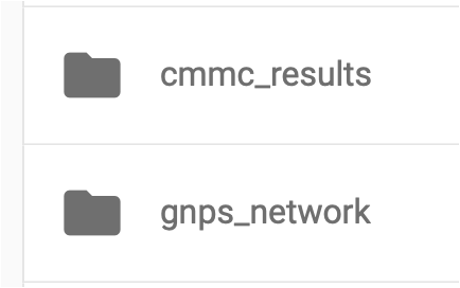

## Network Enrichment Visualization in Cytoscape
Cytoscape is an open-source software platform for visualization and annotation of networks. Cytoscape is available for download from [here](https://cytoscape.org/). The instructions below assume that you have installed Cytoscape 3.10.1.

**Step 1.** Now open Cytoscape 3.10.1. From the Toolbar, go to File > Import > Network from File and then select the **.graphml** file. You can also drag and drop this file into Cytoscape. You can select whichever style you prefer after that.

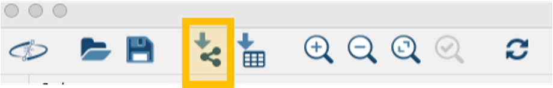

**Step 2.** From the Toolbar, go to File > Import > table from File and then select the **.tsv** file.

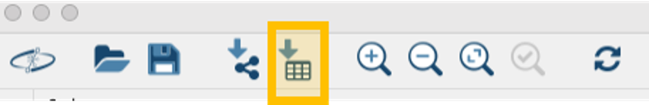

**Step 3.** A new window will open that will look like this.

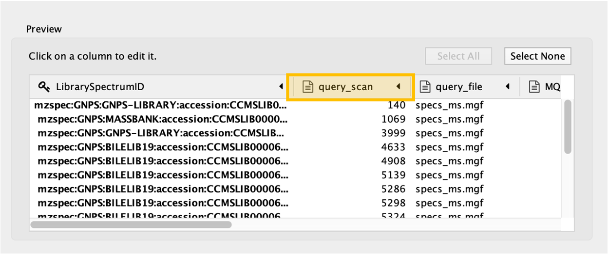

Click on the "**query_scan**" column of the table to be imported, and click on the "**key sign**". This means that this column will be directly compared with the "shared name" column under the Key Column for Network field. In this case, "shared name" is already part of the .graphml file initially imported and it is an information referred to the cluster index (if a classical molecular networking job was run), or to the scan number (if FBMN job was run).

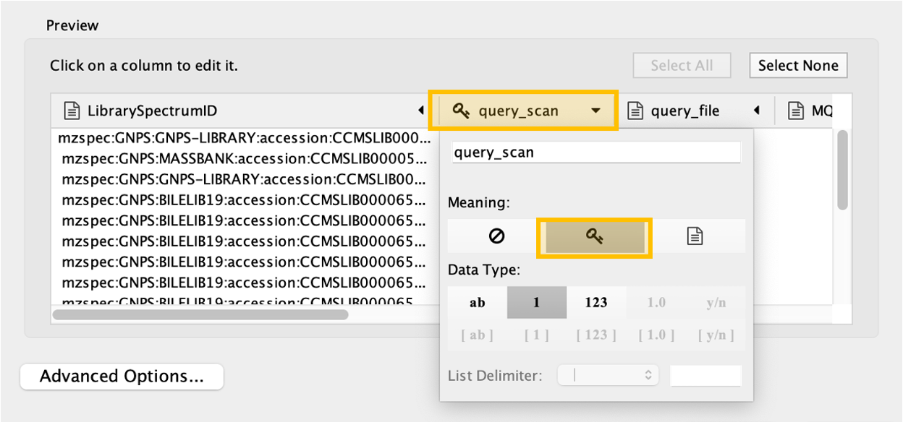

**Step 4.** All the columns present in the imported table can now be observed in the note table, including the  "**input_microbe_name**" column.

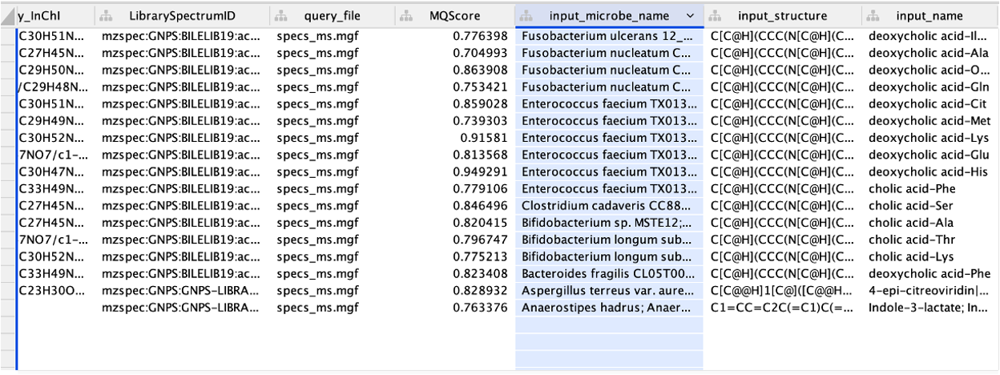

**Step 5.** On the left side menu, under the "Fill Color", in the column select "input_microbe_name" and under "Mapping Type" select "Discrete Mapping".

**Step 6.** Select all the rows that show up (lists of microbes), right-click and "Edit" then, "Edits Selected Discrete Mapping Values". Then, select the color of your choice and your network should like this. In this case, the nodes that are colored as green represent features that had a library match with the spectra deposited in CMMC and that have microbial information associated with them.

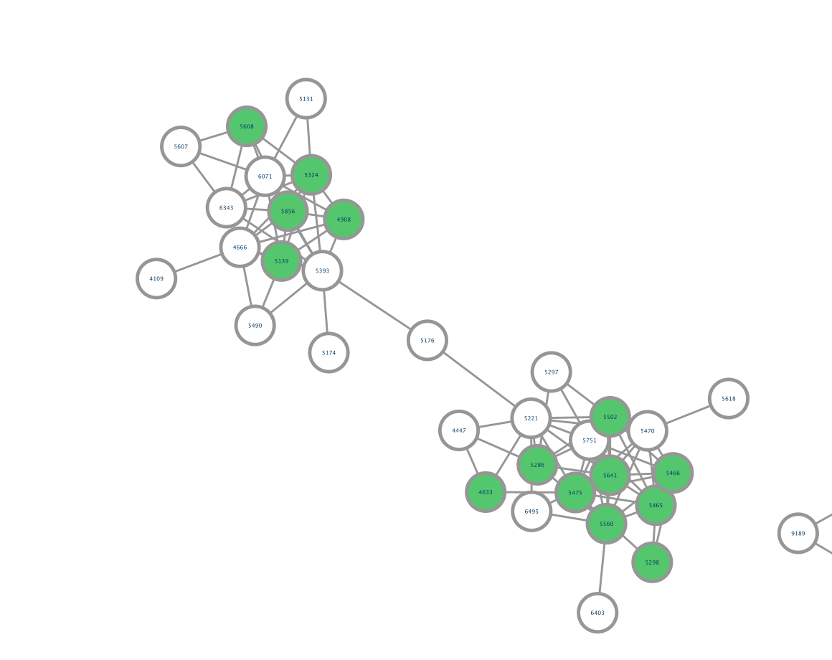

**Step 7.** On the left side, under the "Label", in the column select "Library_compound_name" and under "Mapping Type" select "Passthrough Mapping". In this way, the compound names that were retrieved from CMMC can be shown as nodes labels.

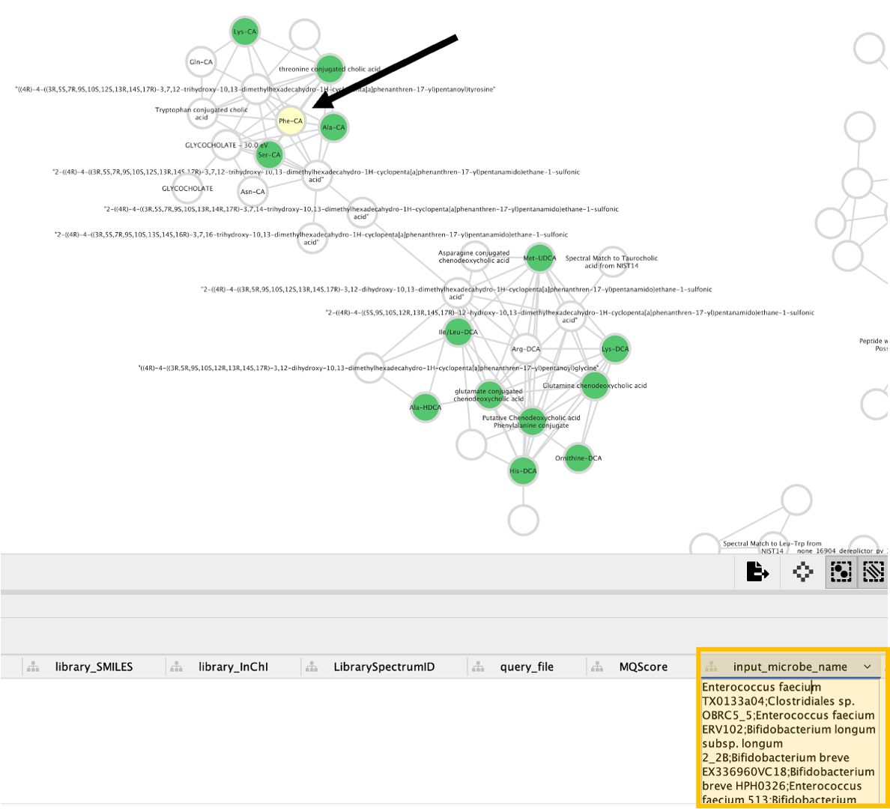

**Step 8.** **Conclusion:** Now, we can see all the microbial-conjugated bile acids (MCBAs) (green nodes), especially which microbes (see yellow box) can produce Phe-CA (see black arrow). 

#### Visualization of taxonomic distribution

**Step 9.** In the "nf_output/cmmc_results" folder, download the "cmmc_taxonomy.tsv" table, which will be uploaded on Cytoscape.

**Step 10.** You can follow the same steps [described in the previously section](#network-enrichment-visualization-in-cytoscape) to import this table into cytoscape, together with the graphml file.

**Step 11.** Once you have imported the phylogeny table, you can click the "Style" menu on the sidebar, and select the 
first box under the "Default" column for the "Image/Chart 1" row.

**Step 12.** A new window will open that will look like this. You should them select **"Charts" (A)**, click the icon depicting the **pie chart (B)**,
select all column with the desired phylogeny level and **add them (C)**. After that you can click **"Customize" (D)**. 

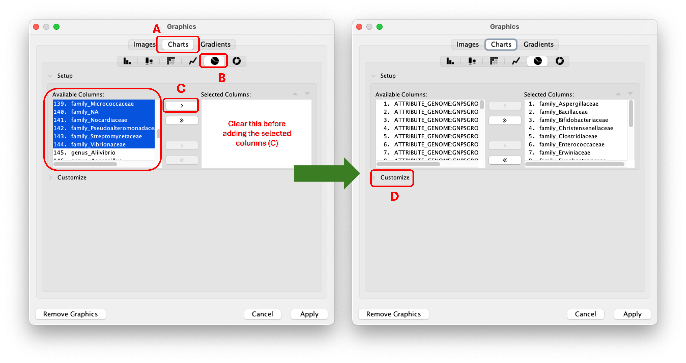

**Step 13.** after that click "Show Value Labels" and change the font size to any desired value. Here you can also change the color pallet for the charts.
Finally, click "Apply" to see the changes.

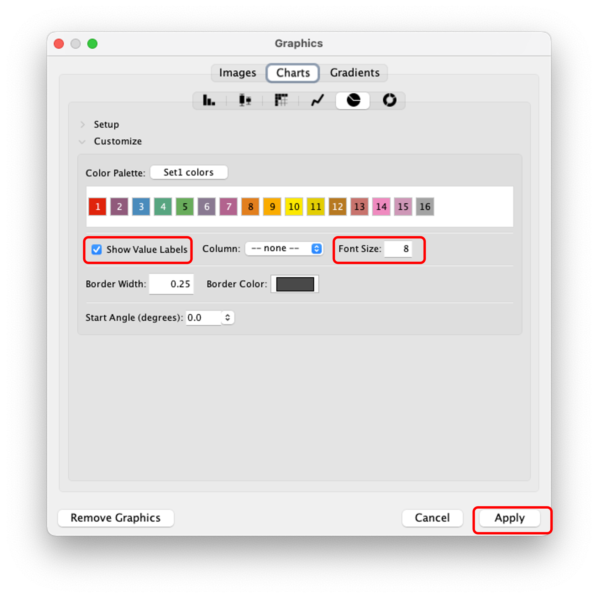

???+ note inline end "Note"
    The pie chart can be customized to show the taxonomic distribution at different levels (e.g., family, genus, species). 
    This information is retrieved from the NCBI taxonomy database using to the taxonomy IDs associated with the microbes in the CMMC-KB.
    You can also change the color palette and size of the pie chart to suit your preferences.

**Step 14.** In the network visualization we can then explore the charts. In the figure below, we can see two nodes with this specific family distribution for the reported microbes. 
For the cholic acid conjugated to serine (cholic acid-ser) depicted here, we can see that we found three matches in the CMMC-KB and that 
the microbes associated are from the families **Bifidobacteriacea, Clostridiacea and Lachnospiraceae**.

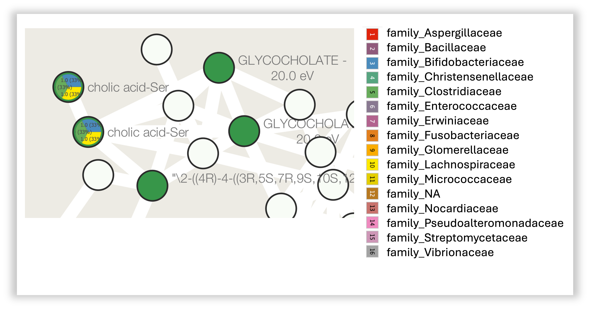

??? tip "Distribution by genus"
    You can also visualize the distribution by genus. To do this, you can follow the same steps as before, but select all the columns with the "**genus_**" prefix  instead of the "family_".
    This will allow you to see the distribution of microbes at the genus level for each node in your network."
    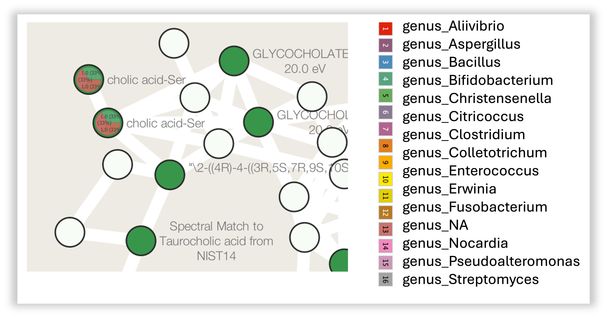

## Page Contributions
Vincent Charron-Lamoureux, Helena Mannochio-Russo, William Nunes

